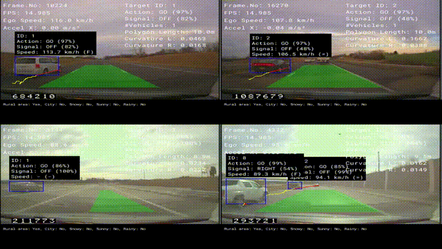
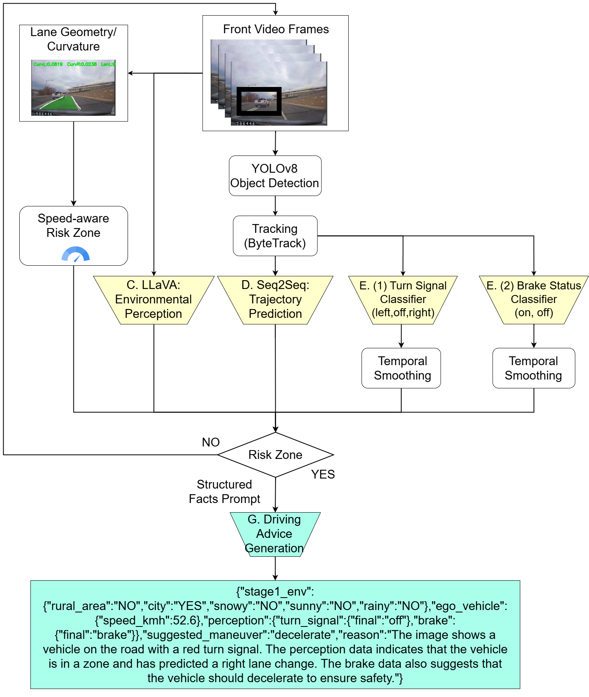

# RiSA: Risk-aware Situational Assistant

RiSA (Risk-aware Situation Assessment) is a research prototype aiming to integrate
object detection, tracking, and risk prediction for driving assistance AI.
RiSA is an open and reproducible research framework for interpretable safety reasoning in naturalistic driving scenarios.  
It integrates environment perception, trajectory forecasting, and multimodal reasoning modules to assist drivers with context-aware safety advice.


## Demo

Below is a short demonstration of the RiSA system in action:



*(The above GIF shows the system's four-panel visualization of driving risk zones, vehicle intentions, and predicted trajectories.)*

## Evaluation Gallery

https://s1280061.github.io/RiSA-clean/eval_gallery/


## Features

- **Multi-stage Environment Recognition**: Scene understanding with LLaVA-based visual reasoning
- **Vehicle Detection & Tracking**: YOLOv8 + ByteTrack for robust multi-object tracking
- **Trajectory Prediction**: Seq2Seq model for forecasting vehicle movements
- **Intent Classification**: Turn signal and brake light detection using custom classifiers
- **BEV Visualization**: Bird's-eye view rendering with lane detection and risk zones
- **Latency Profiling**: Built-in performance measurement for each processing module
- **Risk Assessment**: Real-time yellow-to-red zone transition detection


## System Architecture

The overall architecture of **RiSA (Risk-aware Situational Assistant)** is illustrated below:



This diagram shows the multi-stage pipeline of RiSA, including:
1. **Perception** – YOLOv8-based detection and ByteTrack tracking  
2. **Trajectory Prediction** – GRU/Seq2Seq forecasting of future motion  
3. **Intent Classification** – Turn and brake signal recognition  
4. **Multimodal Reasoning** – LLaVA-based risk assessment  
5. **Visualization** – BEV risk-zone rendering and latency profiling


## Setup

### 1. Clone the repository

```bash
git clone https://github.com/s1280061/RiSA-clean.git
cd RiSA-clean
```

### 2. Create virtual environment (recommended)

```bash
python -m venv venv
venv\Scripts\activate    # Windows
# source venv/bin/activate  # Linux/macOS
```

### 3. Install PyTorch (GPU)
```bash
# CUDA 12.1 example
pip install torch torchvision torchaudio --index-url https://download.pytorch.org/whl/cu121
```

### 4. Install remaining dependencies
```bash
pip install -r requirements.txt
```

### 5. Prepare model weights

This repository does not include pretrained model weights due to size constraints.

Please prepare or download compatible checkpoints and place them under the following structure:

models/
 ├ yolo/best.pt                  # YOLOv8 detector
 ├ traj/traj_seq2seq_best.pt    # Trajectory predictor
 ├ turn/best.pt                 # Turn signal classifier
 └ brake/best.pt                # Brake light classifier

You may train these models using the provided scripts, or substitute your own models,
as long as the paths are updated accordingly in `integrated_script_natural.py`.

## Usage

### Basic Execution

```bash
python integrated_script_natural.py --video path/to/scene_020.mp4 --csv path/to/scene_020.csv
```

### Parameters

- `--video`: Path to input video file (e.g., `scene_020.mp4`)
- `--csv`: Path to corresponding CSV file with frame and speed data (optional)

### Output Files

The script generates the following outputs:

1. **Annotated Video**: `scene_020_with_bev.mp4` - Visualization with BEV and risk zones
2. **Trajectory CSV**: `scene_020_with_bev_traj.csv` - Vehicle trajectories and metadata
3. **Context JSON**: `scene_020_context.json` - Full scene context per frame
4. **LLaVA Records**: `scene_020_llava.json` - Risk assessment results
5. **Latency Logs**: `scene_020_latency.csv` and `.jsonl` - Performance profiling
6. **Risk Transition Data**: `scene_020_risk_transition.csv` - Yellow-to-red zone events

## Data Format

### Input CSV Format

```csv
Frame,Speed
0,45.2
1,45.5
2,45.8
...
```

- **Frame**: Frame number (0-indexed)
- **Speed**: Vehicle speed in mph/mps/kmh (configurable via `SPEED_COL_UNIT`)

### Output Trajectory CSV

Contains per-frame tracking information:

| Column | Description |
|--------|-------------|
| `frame` | Global frame number |
| `track_id` | Unique vehicle ID |
| `x1, y1, x2, y2` | Bounding box coordinates |
| `cx, cy` | Center position (pixels) |
| `vx_px, vy_px` | Velocity (pixels/second) |
| `mx, my` | Position in BEV coordinates (meters) |
| `vmx, vmy` | Velocity in BEV (meters/second) |
| `lane_idx` | Lane classification (0=left, 1=center, 2=right) |
| `cls` | Vehicle class (if detected) |
| `ego_speed_kmh` | Ego vehicle speed |
| `risk_zone` | Current risk flag (LLaVA assessment) |
| `risk_zone_predicted` | Predicted risk based on trajectory |


## 🔧 Configuration

Key parameters can be modified in the script:

### Speed Unit Conversion
```python
SPEED_COL_UNIT = "mph"  # Options: "mph", "mps", "kmh"
```

### BEV Parameters
```python
BEV_FRONT_M = 35       # Forward view distance (meters)
BEV_RIGHT_M = 3.5      # Right lane width (meters)
BEV_LEFT_M = 3.5       # Left lane width (meters)
```

### Tracking Parameters
```python
turn_window_frames = 15   # Turn signal smoothing window
brake_window_frames = 10  # Brake light smoothing window
ENV_REFRESH_EVERY_FRAMES = 100  # Environment recognition interval
```

### Trajectory Prediction
```python
H_PAST = 30   # History frames for trajectory model
H_FUT = 45    # Future frames to predict
```

## Performance Profiling

The integrated latency tracer logs execution time for each module:

- `yolo_detect` - Object detection
- `byte_track` - Multi-object tracking
- `seq2seq_pred` - Trajectory prediction
- `turn_cls` / `brake_cls` - Intent classification
- `stage1_env` - Environment recognition
- `llava_assess` - Risk assessment
- `visualization` - Frame rendering
- `video_write` - Output encoding

Logs include:
- Start/end timestamps
- Frame-aligned indices
- GPU synchronization markers
- Per-frame metadata

## Risk Transition Analysis

The system automatically detects and records yellow-to-red risk zone transitions:

### Transition Criteria
1. **Yellow Zone**: LLaVA detects high/very_high risk
2. **Red Zone**: Predicted trajectory enters stopping distance + ego speed ≥ 40 km/h

### Output Files
- `scene_020_risk_transition.csv` - Summary of each transition event
- `scene_020_risk_transition_series.csv` - Frame-by-frame data during transitions
- `risk_transition_summary.json` - Cross-scene aggregation

## Dataset Access

RiSA was developed and evaluated using the **SHRP2 Naturalistic Driving Study (NDS)** dataset.  
This dataset contains privacy-sensitive, real-world driving videos and sensor data collected under restricted research agreements.

As such, **the raw SHRP2 data cannot be publicly distributed** due to confidentiality and usage restrictions.

Researchers who wish to reproduce our experiments can apply for access through the official portal:  
🔗 [SHRP2 NDS Data Access Portal](https://insight.shrp2nds.us/)

Once approved, the dataset can be organized following the same structure assumed by our scripts (e.g., `scene_000.mp4`, `csv_divided/scene_000.csv`).

> **Note:**  
> The provided code and pretrained models are fully operational once SHRP2 access is granted,  
> but this repository does **not include any SHRP2-derived videos or annotations**.


## Example Output

### Console Log
```
[INFO] Starting integrated processing...
[INFO] Video file: scene_020.mp4
[INFO] Resolution: 360x240, FPS: 30.00, Frames: 1500
[INFO] Models loaded successfully.
[     0/  1500]   0.1% det: 3 trk: 3 elapsed:   2.5s
[    10/  1500]   0.7% det: 5 trk: 5 elapsed:   8.2s
...
[INFO] Processing time: 256.3s
[INFO] Processed frames: 1,500
[INFO] Process finished.
```

### Risk Transition Summary
```
[INFO] Transition time stats: n=8 mean=234.5ms median=220.0ms min=180.0ms max=310.0ms
```

## Troubleshooting

### CUDA Out of Memory
- Reduce batch size or frame resolution
- Process shorter video segments
- Use CPU mode (set device to `"cpu"`)

### Missing Model Weights
```
[ERROR] Turn signal model loading failed
```
→ Ensure all `.pt` files are in the correct directories

### CSV Frame Offset Issues
```
[WARN] Frame offset detection failed
```
→ Verify CSV has a `Frame` column starting from the correct index


## License

This project is licensed under the MIT License - see the [LICENSE](LICENSE) file for details.

## Citation

If you find our study useful, please consider citing:


```bibtex
@inproceedings{asai2025risa,
  title     = {RiSA: Risk-aware Situational Assistant: From Risk Forecasting to Actionable Driver Advice},
  author    = {Kaito Asai and Bin Zhou and Jianyu Huang and Yutaka Arakawa and Tsunenori Mine},
  booktitle = {Proceedings of the IEEE International Conference on Big Data (IEEE BigData)},
  year      = {2025},
  note      = {Accepted (to appear)},
}
```

## Acknowledgments

- **YOLOv8**: [Ultralytics](https://github.com/ultralytics/ultralytics)
- **ByteTrack**: [ByteTrack Repository](https://github.com/ifzhang/ByteTrack)
- **LLaVA**: [LLaVA Model](https://github.com/haotian-liu/LLaVA)
- **SHRP2 Dataset**: [SHRP2 NDS](https://insight.shrp2nds.us/)

## Contact

For questions or collaborations:
- Email: asai.kaito@arakawa-lab.com
- GitHub Issues: [Create an issue](https://github.com/s1280061/RiSA-clean/issues)

**Note**: This is a research prototype. Use at your own risk in real-world applications.
